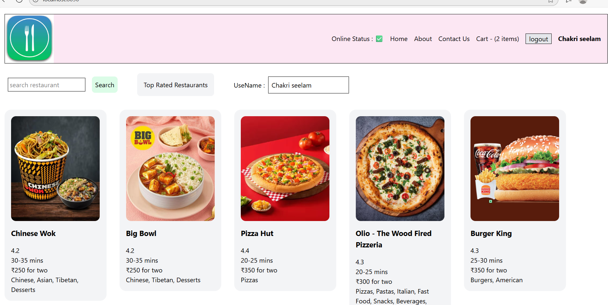

Swiggy App — CI/CD + GitOps + Kubernetes (EKS)

This project demonstrates how to containerize, deploy, and manage a full-stack Swiggy-like app using modern DevOps practices.
We implement:

CI/CD with Jenkins → build & push Docker images to Amazon ECR

GitOps with Argo CD → automatically sync Kubernetes manifests from GitHub

Amazon EKS (Elastic Kubernetes Service) → production-grade Kubernetes cluster

AWS Route 53 → custom DNS for app access


Prerequisites

AWS account + AWS CLI configured (aws configure)

eksctl, kubectl, aws-iam-authenticator, helm installed locally (or CI server).

Jenkins server with Docker + Git + AWS credentials (or use Jenkins agents with these).

Argo CD (installed in the cluster).

Route 53 hosted zone if you want a custom domain.

Step 1 — Create ECR repository

```bash

aws ecr create-repository --repository-name swiggy-app --region us-east-1

```

Step 2 — Jenkins pipeline (CI) — example Jenkinsfile

Place this Jenkinsfile in repo root. It:

Builds Docker image,

Pushes to ECR,

Updates k8s/deployment.yaml image tag and commits it back to repo (Argo CD will pick it up).

Step 3 — Create an EKS cluster 

Use eksctl:
```bash

eksctl create cluster \
  --name swiggy-eks \
  --region us-east-1 \
  --nodes 2 \
  --node-type t3.medium \
  --managed
# configure kubectl
aws eks --region us-east-1 update-kubeconfig --name swiggy-eks
kubectl get nodes

```

Step 4 — Install Argo CD in the cluster

```bash

kubectl create namespace argocd
kubectl apply -n argocd -f https://raw.githubusercontent.com/argoproj/argo-cd/stable/manifests/install.yaml
# Optionally expose argocd-server via LoadBalancer (dev only) or use port-forward
kubectl -n argocd get pods
# Get admin password
kubectl -n argocd get secret argocd-initial-admin-secret -o jsonpath="{.data.password}" | base64 -d
# port-forward to access UI (dev)
kubectl -n argocd port-forward svc/argocd-server 8443:443
# open https://localhost:8443

```

Step 8 — DNS (Route 53) & HTTPS

After service is created on EKS, find the ALB hostname:

```bash

kubectl get svc swiggy-app -n default
# external hostname looks like: a1b2c3d4e5f6-123456789.us-east-1.elb.amazonaws.com

```




